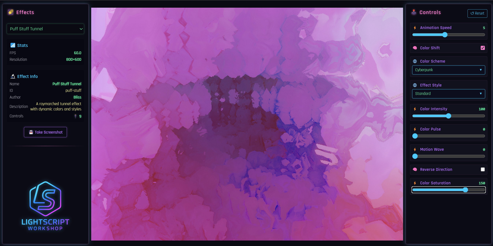

<div align="center">

# 🌠 LightScript Workshop for SignalRGB 🔮


_Create mind-bending RGB lighting effects with modern tools_



</div>

LightScript Workshop is a modern TypeScript framework for creating stunning RGB lighting effects for [SignalRGB](https://signalrgb.com/). Transform the way you build Lightscripts with a type-safe, decorator-based approach featuring hot reloading, WebGL integration, and an efficient build system.

## 🚀 What's New (v0.9.2)

### 🎨 New Mind-Bending Effects
- **🌊 Quantum Foam** - Virtual particles with wave function collapse visualization
- **🧠 ADHD Hyperfocus** - Tunnel vision with dopamine-seeking patterns
- **⚡ Neural Synapse Fire** - ML-inspired neural network activation patterns
- **💥 Reality.exe Has Stopped Working** - Windows error dialogs in RGB chaos
- **🧬 Cellular Automaton RGB** - Conway's Game of Life on your keyboard
- **🌀 Black Hole** - Gravitational lensing with event horizon effects
- **💎 Voronoi Flow** - Cellular patterns with fluid dynamics
- **⏰ Temporal Hallucination** - Time-bending patterns that predict the future

### 🛠️ Developer Experience Improvements
- **📝 GLSL Linting** - Comprehensive shader validation and formatting
- **💾 Effect Persistence** - Remembers your last selected effect across reloads
- **🎯 Prettier Integration** - GLSL formatting with aligned comments support
- **🔧 Biome Integration** - Fast, modern linting and formatting
- **📊 Performance Controls** - Quality/performance trade-offs in effects

## ⚡ Features

- **🔷 Modern TypeScript** - Full type safety with decorator-based controls
- **🔮 Three.js & WebGL** - Powerful GPU-accelerated rendering
- **🎨 Canvas 2D Support** - Traditional drawing API for simpler effects
- **⚡ Hot Reloading** - Instant visual feedback with effect persistence
- **🧩 Decorator-Based Controls** - Type-safe UI elements with TypeScript decorators
- **⚙️ Optimized Build Pipeline** - Production-ready effects with Vite
- **🧪 Testing Framework** - Maintain quality with Vitest
- **🤖 AI-Assisted Development** - Create effects with AI assistance
- **📐 GLSL Tools** - Linting, formatting, and validation for shaders
- **🎮 Live Development UI** - Interactive controls with real-time preview

## 🌐 Quick Start

```bash
# Clone the repository
git clone https://github.com/hyperb1iss/lightscript-workshop.git
cd lightscript-workshop

# Install dependencies
npm install

# Start development server
npm run dev
```

Then open your browser to http://localhost:4096 to see the effect gallery. The UI remembers your last selected effect!

## 📚 Documentation

We've created comprehensive documentation to help you get the most out of LightScript Workshop:

- [**Developer Guide**](/docs/developer-guide.md) - Start here for a complete introduction
- [**API Reference**](/docs/api-reference.md) - Detailed technical documentation
- [**Examples**](/docs/examples.md) - Ready-to-use effect examples with explanations
- [**Advanced Guide**](/docs/advanced.md) - Deep dives into advanced techniques
- [**AI-Assisted Development**](/docs/ai-assisted-development.md) - Create effects with AI assistance
- [**Creative Ideas Catalog**](/docs/CREATIVE_IDEAS_CATALOG.md) - 50+ wild effect concepts
- [**Technical Recommendations**](/docs/TECHNICAL_RECOMMENDATIONS.md) - Performance & architecture tips

## 🌈 Available Effects Gallery

### 🧠 AI & Generative
- **Neural Synapse Fire** - Real neural network mathematics visualized
- **Quantum Foam** - Planck-scale virtual particles and wave collapse
- **Cellular Automaton RGB** - Conway's Game of Life and other automata

### 🌀 Physics & Mathematics
- **Black Hole** - Gravitational lensing with Hawking radiation
- **Voronoi Flow** - Cellular patterns with fluid dynamics
- **Kaleido Tunnel** - Kaleidoscopic tunnel with configurable symmetry

### 🎮 Digital & Glitch Art
- **Reality.exe Has Stopped Working** - Windows errors as art
- **Cyber Descent** - Cyberpunk-inspired matrix rainfall
- **Temporal Hallucination** - Time-bending predictive patterns

### 🧠 Neurodivergent Experience
- **ADHD Hyperfocus** - Tunnel vision with dopamine sparks

### ✨ Classic Effects
- **Puff Stuff Tunnel** - Ray-marched psychedelic tunnel
- **Simple Wave** - Smooth sine wave animations
- **Glow Particles** - Vibrant particle system with trails

## 💻 Development Workflow

### Creating a New Effect

1. **Generate** with the effect creator (coming soon) or manually create:
   ```
   effects/your-effect-name/
   ├── fragment.glsl  # Shader code
   └── main.ts        # Effect implementation
   ```

2. **Register** in `src/index.ts`:
   ```typescript
   export const effects = [
     // ... existing effects
     {
       entry: './effects/your-effect-name/main.ts',
       id: 'your-effect-name'
     }
   ]
   ```

3. **Develop** with hot reloading:
   ```bash
   npm run dev
   ```

4. **Lint** your shaders:
   ```bash
   npm run lint:glsl
   ```

5. **Build** for SignalRGB:
   ```bash
   EFFECT=your-effect-name npm run build
   ```

## 🎮 Control Types

Effects can use these decorator-based controls:

```typescript
@NumberControl({
  label: 'Speed',
  min: 0,
  max: 200,
  default: 100,
  tooltip: 'Animation speed'
})
speed!: number

@BooleanControl({
  label: 'Enable Glow',
  default: true
})
glowEnabled!: boolean

@ComboboxControl({
  label: 'Color Mode',
  values: ['Rainbow', 'Neon', 'Monochrome'],
  default: 'Rainbow'
})
colorMode!: string
```

## ⚙️ Scripts & Commands

```bash
# Development
npm run dev           # Start dev server with hot reload
npm run typecheck     # Check TypeScript types
npm run lint          # Run Biome linter
npm run lint:glsl     # Lint GLSL shaders
npm run format        # Format code with Biome

# Building
npm run build         # Build all effects
npm run build:debug   # Build without minification
EFFECT=name npm run build  # Build specific effect

# Testing
npm test              # Run tests
npm run test:ui       # Run tests with UI
npm run coverage      # Generate coverage report
```

## 🔧 Configuration

### Prettier for GLSL

The project includes GLSL formatting with `prettier-plugin-glsl`. To preserve aligned comments in shaders, use:

```glsl
// prettier-ignore
// Controls
uniform float iScale;        // 0.3..4.0  (cell size)
uniform float iSpeed;        // 0..2      (flow speed)
```

### TypeScript

Configured for Preact with automatic JSX runtime and decorator support.

### Biome

Modern, fast linter configured for TypeScript and Preact with sensible defaults.

## 🎮 SignalRGB Integration

1. Build your effect: `EFFECT=effect-name npm run build`
2. Copy the HTML file from `dist/` to:
   - Windows: `~/Documents/WhirlwindFX/Effects`
   - macOS: `~/Documents/SignalRGB/Effects`
3. Restart SignalRGB or refresh effects
4. Your effect appears in the "Lighting Effects" section

## 🤝 Contributing

Contributions are welcome! Whether you're fixing bugs, improving documentation, or creating wild new effects, we'd love your help.

### Areas for Contribution
- New mind-bending effects
- Performance optimizations
- Documentation improvements
- UI/UX enhancements
- Testing coverage
- GLSL shader techniques

Check out [CREATIVE_IDEAS_CATALOG.md](/docs/CREATIVE_IDEAS_CATALOG.md) for effect inspiration!

## 📦 Tech Stack

- **Framework**: TypeScript + Vite + Preact
- **Graphics**: Three.js, WebGL, Canvas 2D
- **Shaders**: GLSL ES 3.00 / WebGL 2.0
- **Linting**: Biome + Custom GLSL linter
- **Formatting**: Prettier + prettier-plugin-glsl
- **Testing**: Vitest + @vitest/coverage-v8
- **Build**: Rollup via Vite

## 🎯 Roadmap

- [ ] Visual shader editor
- [ ] Effect marketplace
- [ ] AI effect generator
- [ ] Performance profiler
- [ ] Mobile preview app
- [ ] Effect chaining/layering
- [ ] Audio reactivity
- [ ] Community effect sharing

## 📄 License

This project is licensed under the MIT License - see the [LICENSE](LICENSE) file for details.

---

<div align="center">

Created by [Stefanie Jane 🌠](https://github.com/hyperb1iss)

If you love lightscript-workshop, star the repo and [buy me a Monster Ultra Violet](https://ko-fi.com/hyperb1iss)! ⚡️

</div>