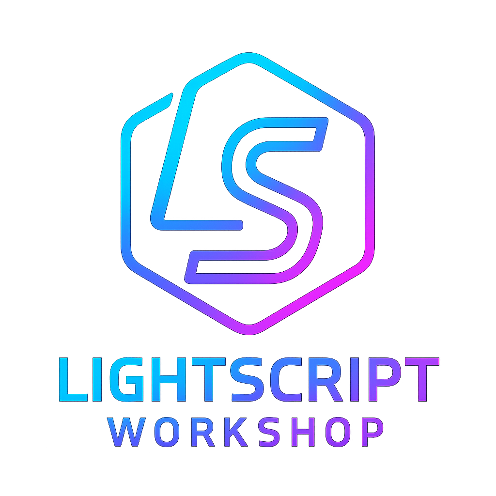

<div align="center">



### _Mind-bending RGB effects for the chronically creative_

[](https://www.typescriptlang.org/)
[](https://threejs.org/)
[](https://www.khronos.org/webgl/)
[](https://vitejs.dev/)
[](https://signalrgb.com/)

[](LICENSE)
[](https://github.com/hyperb1iss/lightscript-workshop/stargazers)

[📚 Documentation](https://hyperb1iss.github.io/lightscript-workshop/) · [🎮 Playground](https://hyperb1iss.github.io/lightscript-workshop/playground/) · [🌀 Quick Start](#-quick-start)

</div>

---

## 🔮 What is LightScript Workshop?

**LightScript Workshop** is a TypeScript framework for creating custom lighting effects for [SignalRGB](https://signalrgb.com/) — the app that unifies control of your RGB keyboards, mice, headsets, and other PC peripherals.

Instead of being limited to SignalRGB's built-in effects, LightScript lets you write your own using **WebGL shaders** or **Canvas 2D**, with a modern development experience:

- 🎨 **TypeScript decorators** that automatically generate SignalRGB's control UI
- 🔥 **Hot reloading** so you see changes instantly as you code
- 🎵 **Audio reactivity** built-in — sync your lights to music
- 💎 **GPU-accelerated rendering** via Three.js and WebGL
- 📦 One command to **build standalone HTML files** that drop right into SignalRGB

Whether you want pulsing black holes, glitchy cyberpunk rain, or particle swarms that react to your music — if you can imagine it, you can build it.

---

## 🌀 Quick Start

```bash
git clone https://github.com/hyperb1iss/lightscript-workshop.git
cd lightscript-workshop
pnpm install
pnpm dev
```

Open [localhost:4096](http://localhost:4096) — you'll see a live preview with controls. Pick an effect from the sidebar, tweak the sliders, and watch your creation in real-time.

---

## 🌌 Effect Gallery

LightScript ships with a collection of effects to use, remix, or learn from:

| Effect | What It Does |
|--------|--------------|
| 🕳️ **Black Hole** | Gravitational lensing with an accretion disk and Hawking radiation |
| 💎 **Voronoi Flow** | Cellular patterns morphing with fluid dynamics |
| ⚛️ **Quantum Foam** | Planck-scale virtual particles popping in and out of existence |
| 🌧️ **Cyber Descent** | Cyberpunk matrix rainfall with scanline artifacts |
| 🔮 **Kaleido Tunnel** | Raymarched kaleidoscopic infinity tunnel |
| 💜 **Glow Particles** | Vibrant particle swarms with luminous trails |
| 🎵 **Audio Pulse** | Reactive rings that pulse to your music |
| 👁️ **Iris** | Geometric audio visualizer with dynamic tessellation |
| 🧠 **Neural Synapse Fire** | Synaptic networks firing in cascading patterns |
| 🎯 **ADHD Hyperfocus** | Tunnel vision with dopamine-seeking sparkles |

---

## 🔧 How It Works

Effects are TypeScript classes paired with GLSL fragment shaders. Decorators define the controls that appear in SignalRGB:

```typescript
import { Effect, NumberControl, WebGLEffect, initializeEffect } from '@lightscript/core'
import fragmentShader from './fragment.glsl'

@Effect({ name: 'Neon Dreams', author: 'You' })
export class NeonDreams extends WebGLEffect<{ speed: number }> {
  @NumberControl({ label: 'Speed', min: 1, max: 10, default: 5 })
  speed!: number

  constructor() {
    super({ id: 'neon-dreams', name: 'Neon Dreams', fragmentShader })
  }

  // ... control value mapping and uniform updates
}

initializeEffect(() => new NeonDreams().initialize())
```

The shader receives your control values as uniforms:

```glsl
uniform float iTime;
uniform vec2 iResolution;
uniform float iSpeed;

void mainImage(out vec4 fragColor, vec2 fragCoord) {
    vec2 uv = fragCoord / iResolution.xy;
    float t = iTime * iSpeed;
    vec3 col = 0.5 + 0.5 * cos(t + uv.xyx + vec3(0, 2, 4));
    fragColor = vec4(col, 1.0);
}

void main() { mainImage(gl_FragColor, gl_FragCoord.xy); }
```

Drop these files in `src/effects/neon-dreams/` — the framework auto-discovers them. No registration needed.

---

## 💎 Features

| | Feature | Description |
|--|---------|-------------|
| 🎮 | **WebGL + Canvas 2D** | GPU-accelerated shaders or traditional Canvas drawing — your choice |
| 🎛️ | **Decorator Controls** | `@NumberControl`, `@BooleanControl`, `@ComboboxControl` — type-safe UI generation |
| 🔥 | **Hot Reloading** | Edit shader code, see it instantly. No refresh, no waiting. |
| 🎵 | **Audio Reactive** | Built-in FFT analysis with bass/mid/treble helpers and spectrum textures |
| 🤖 | **AI-Native** | Structured patterns that Claude, Cursor, and Copilot understand |
| 📦 | **Monorepo** | `@lightscript/core` for the API, `@lightscript/dev` for tooling |

---

## 🗂️ Project Structure

```
lightscript-workshop/
├── packages/
│   ├── core/              # @lightscript/core — Framework API
│   └── dev/               # @lightscript/dev — Dev server & build tools
├── src/
│   ├── effects/           # Your effects live here
│   └── shaders/           # Shared GLSL utilities (noise, colors, SDFs)
├── docs/                  # VitePress documentation
└── dist/                  # Built effects ready for SignalRGB
```

---

## ⌨️ Commands

| Command | What It Does |
|---------|--------------|
| `pnpm dev` | Start dev server with hot reload |
| `pnpm build:effects` | Build all effects to `dist/` |
| `pnpm docs` | Preview documentation locally |
| `pnpm typecheck` | Run TypeScript type checking |
| `pnpm test` | Run test suite |
| `pnpm lint` | Lint with Biome |

---

## 🪐 Deploy to SignalRGB

Build your effect:

```bash
EFFECT=black-hole pnpm build:effects
```

Copy the generated HTML file to SignalRGB's effects folder:
- **Windows:** `~/Documents/WhirlwindFX/Effects/`
- **macOS:** `~/Documents/SignalRGB/Effects/`

Restart SignalRGB, find your effect under "Lighting Effects", and bask in the glow.

---

## 🤖 AI-Powered Development

LightScript's consistent patterns make it ideal for AI-assisted development. Try this prompt:

> Create a WebGL effect called "aurora-waves" that simulates northern lights. Add controls for speed (1-10), intensity (0-200), and a color palette dropdown. Reference `src/effects/black-hole/main.ts` for the pattern.

See [CLAUDE.md](CLAUDE.md) for complete AI agent documentation and the patterns that make generation reliable.

---

## 📚 Documentation

Full documentation at **[hyperb1iss.github.io/lightscript-workshop](https://hyperb1iss.github.io/lightscript-workshop/)**

- 🌌 [Getting Started](https://hyperb1iss.github.io/lightscript-workshop/getting-started/) — Installation and your first effect
- 📖 [Reference](https://hyperb1iss.github.io/lightscript-workshop/reference/) — Complete API documentation
- 💡 [Examples](https://hyperb1iss.github.io/lightscript-workshop/examples/) — Code patterns and snippets
- 🎮 [Playground](https://hyperb1iss.github.io/lightscript-workshop/playground/) — Try effects in your browser

---

## 💜 Contributing

Got a wild effect idea? Performance optimization? Bug fix? Contributions welcome.

```bash
pnpm install && pnpm dev   # Get running
# Make something awesome
pnpm test && pnpm lint     # Make sure it's solid
```

---

## 📜 License

MIT License — see [LICENSE](LICENSE)

---

<div align="center">

Created by [Stefanie Jane 🌠](https://github.com/hyperb1iss)

If your RGB setup has transcended, [buy me a Monster Ultra Violet](https://ko-fi.com/hyperb1iss)! ⚡️

</div>
